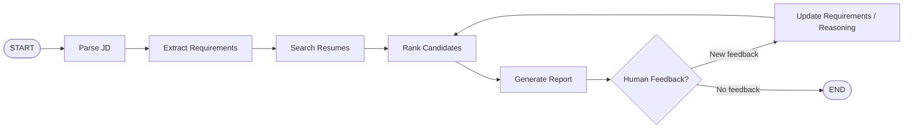

# Agent State Machine

## State

`MatchingAgentState` stores conversation history, job description, extracted requirements, candidate shortlist, reasoning, generated report, reviewer feedback, review rounds, and whether human review is required.

## Tool boundaries

- Parse and extraction nodes understand the job description.
- Search uses the Milestone 1 filesystem tools and Milestone 2 RAG tool.
- Ranking and reporting produce the shortlist and explanations.
- The human feedback branch supports iterative refinement before completion.
